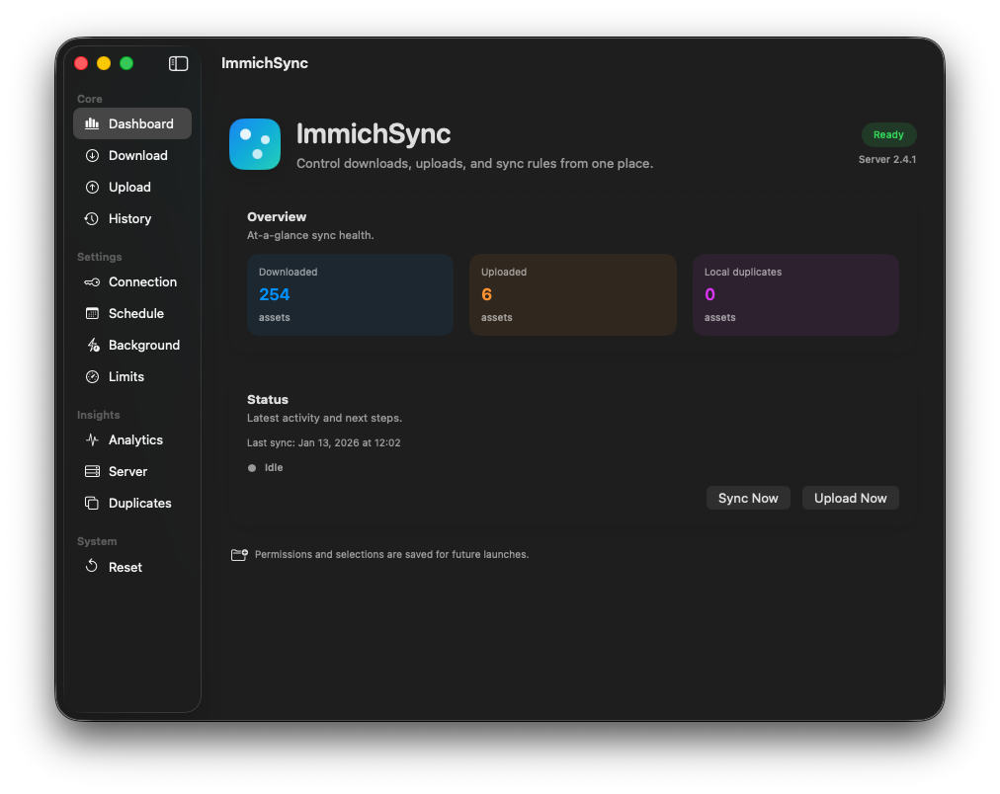

<div align="center">
  
  <h1>ImmichSync</h1>
  <p>Fast, local-first backup and upload companion for your Immich server on macOS.</p>

  <p>
    <a href="#readme">README</a> ·
    <a href="#install-unsigned-build">Install</a> ·
    <a href="#dev-build">Dev Build</a> ·
    <a href="#how-it-works">How It Works</a> ·
    <a href="#contributing">Contributing</a> ·
    <a href="#license">MIT License</a>
  </p>

  <p>
    
    
  </p>

  <p>
    <a href="https://github.com/bjoernch/Immichsync/releases/latest">Download</a>
    &nbsp;·&nbsp;
    <a href="https://github.com/bjoernch/Immichsync/releases">Latest Release</a>
  </p>
</div>

---

## README

ImmichSync keeps a local copy of your Immich assets and can watch a local folder to upload new files back to your server. It is designed for reliable syncing with clear status, safety controls, and a menu bar companion.

<p align="center">
  
</p>

## Install (unsigned build)

1) Download `ImmichSync.dmg` or `ImmichSync.zip` from the latest release:  
   https://github.com/bjoernch/Immichsync/releases/latest
2) Open the DMG/ZIP and drag `ImmichSync.app` to `/Applications`.  
3) If macOS blocks it, right‑click the app → **Open**, or allow it in System Settings → Privacy & Security.

## Dev build

### Run from source (debug)

```bash
swift run
```

### Build a clickable app bundle

```bash
./scripts/build-app.sh
```

Output: `dist/ImmichSync.app`

### Build release ZIP/DMG

```bash
./scripts/package-release.sh
```

Outputs: `dist/ImmichSync.zip` and `dist/ImmichSync.dmg`

### Troubleshooting local builds

- If assets or permissions look wrong, delete the app data folder:
  `~/Library/Application Support/ImmichSync`
- If the menu bar icon does not update, quit and relaunch the app.
- If macOS blocks the app, use **Open** from the right‑click menu.

## How it works

### Core features
- Download assets with filters (photos/videos), album filters, and folder structure rules.
- Upload watcher for a local folder (queue + live sync).
- Menu bar status with quick controls.
- Scheduling + background launch agent for unattended syncs.
- Speed stats, status lists, and sync history.
- Optional server duplicate checking before upload.

### Download behavior
- Supports flat, year, and year/month folder structures.
- Optional sidecar metadata JSON.
- Optional integrity verification (size + checksum).
- Local duplicate scan with a safety cap for large libraries.

### Upload behavior
- Watches the selected folder and optional subfolders.
- Server-side duplicate check can skip already uploaded items.
- Local upload history prevents re-uploads unless cleared.
- All uploads go to the main Immich timeline.

### Connection checks
- Quick validation of server URL and API key.
- Displays which features are available based on permissions.

## Permissions (full access)

To use all features, grant these API key scopes:
- `asset.read`
- `asset.download`
- `asset.upload`
- `album.read`
- `duplicate.read`
- `server.about`

## Credentials and security

- API key is saved locally only after you click **Save API Key**.
- Keychain storage is available only when Touch ID is enabled.
- Touch ID gating is optional and protects access to the app UI.

## Storage locations

- Preferences: `UserDefaults`
- App data: `~/Library/Application Support/ImmichSync`
- Keychain entry: service name `ImmichSync` (if enabled)

## GitHub Releases (automatic)

Push a tag like `v1.0.0` and GitHub Actions will build and attach ZIP/DMG to a published release.

```bash
git tag v1.0.0
git push origin v1.0.0
```

## Contributing

Issues and pull requests are welcome. If you plan a larger change, please open an issue first so we can align on scope and behavior.

## License

MIT License.
